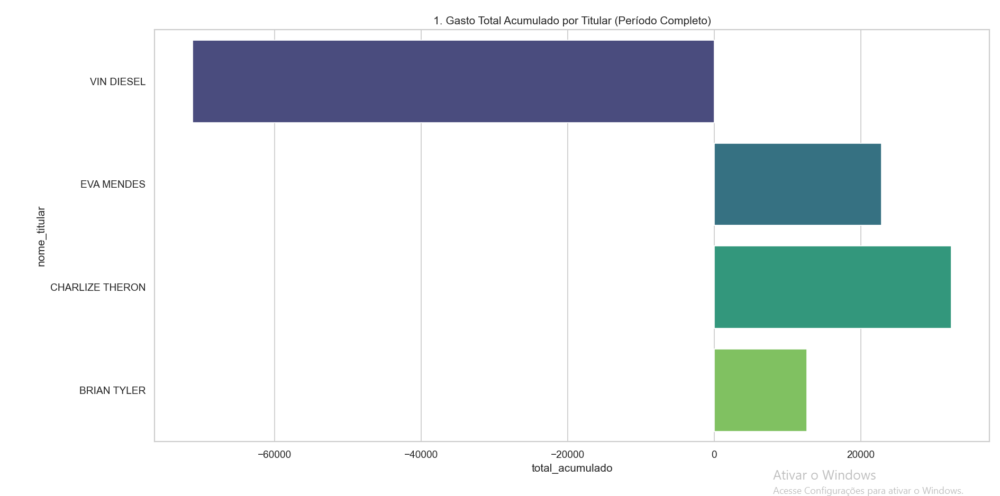
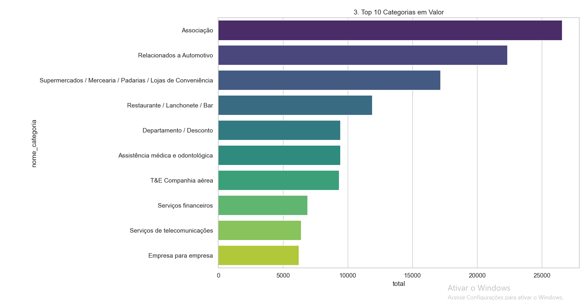
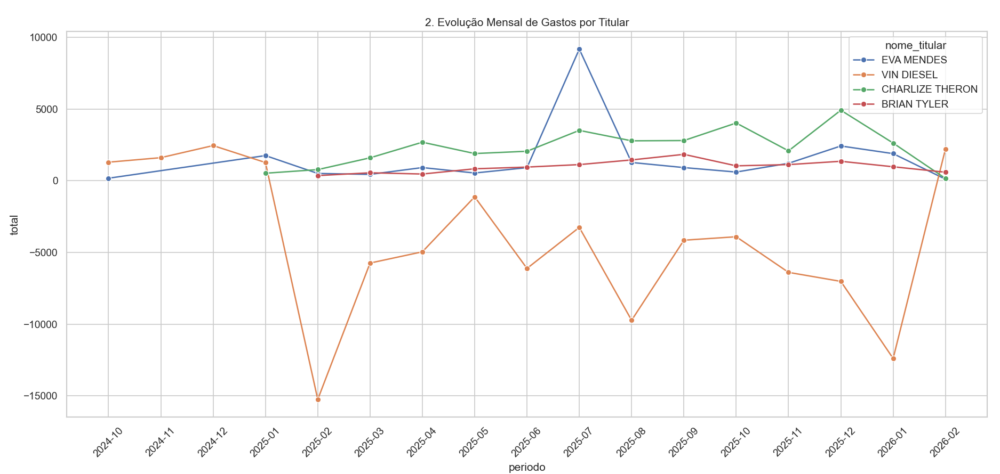
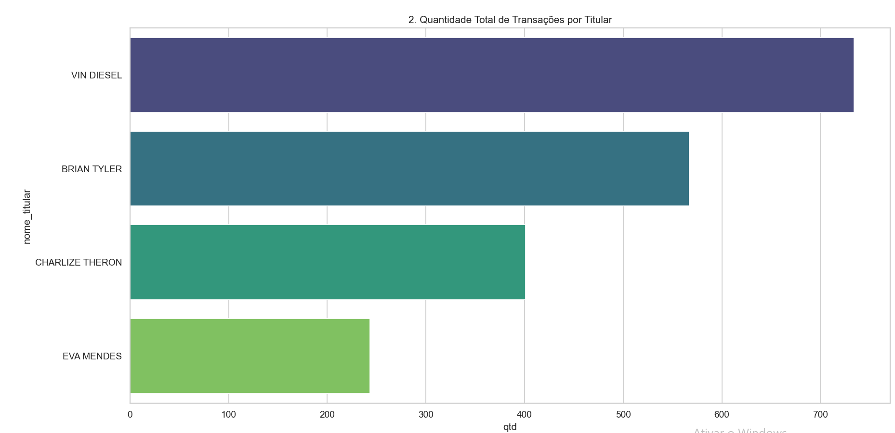
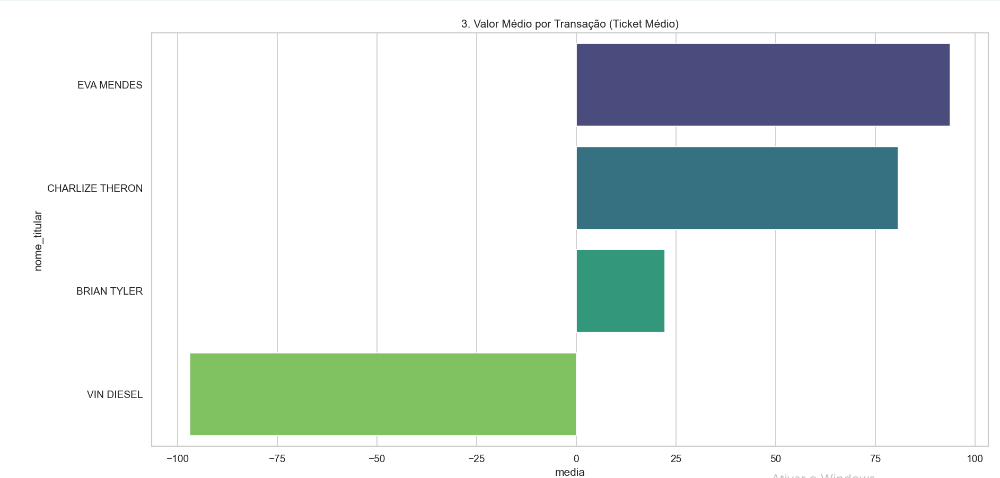
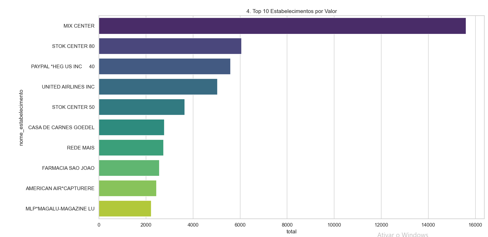
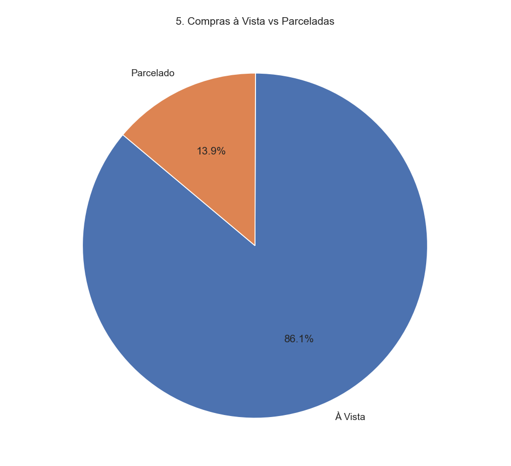
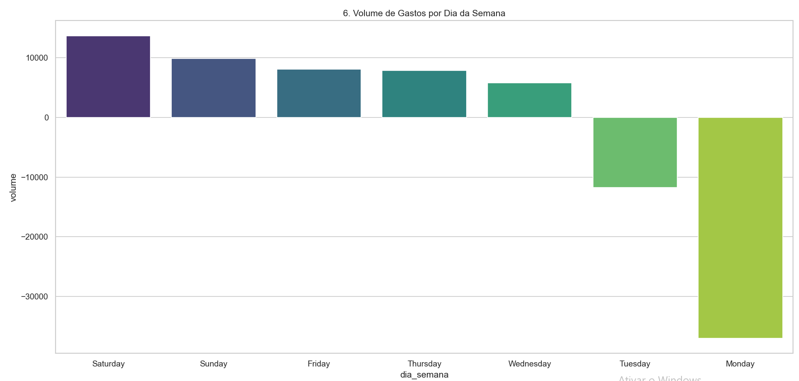
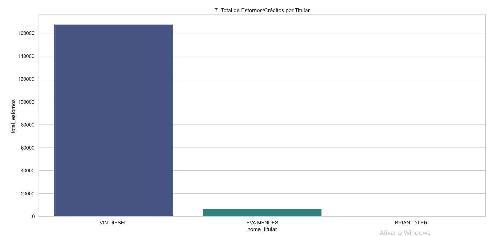

## 📊 Perguntas de Negócio e Respostas (Dashboards)

Com base no processamento dos 12 meses de faturas, foram geradas as seguintes análises para apoiar a compreensão dos padrões de consumo:

### 💰 Gasto Total Acumulado
Apresenta o valor total gasto por cada titular ao longo do período, permitindo uma visão geral do nível de consumo individual.

---

### 🛒 Gasto por Categoria
Mostra as 10 categorias com maior volume de gastos, destacando onde estão concentradas as principais despesas.

---

### 📈 Evolução Mensal do Total Gasto
Exibe a variação dos gastos ao longo dos meses, facilitando a identificação de períodos de maior ou menor consumo.

---

### ⚖️ Comparativo entre Titulares
Compara os titulares em termos de valor médio gasto e quantidade de transações realizadas.

---

### 🏪 Principais Estabelecimentos
Apresenta os estabelecimentos com maior volume de gastos ou número de transações.

---

### 💳 Comportamento de Parcelamento
Mostra a proporção entre compras realizadas à vista e parceladas ao longo do período.

---

### 📅 Principais Dias da Semana
Indica em quais dias da semana ocorrem mais transações ou maiores volumes de gasto.

---

### 🔄 Estornos e Créditos
Apresenta os valores de estornos e créditos, permitindo visualizar ajustes financeiros ao longo do tempo.

